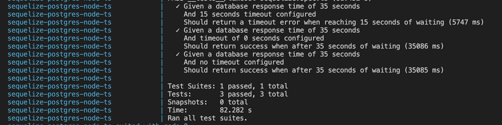

# POC: How to configure timeout on statements in postgres using sequelize client

#### before starting you must have configured docker and docker compose on your machine

## Setup

### Install the dependencies
``` bash
npm install
```
### Run the test
``` bash
docker-compose up
```

### Expected outcome


